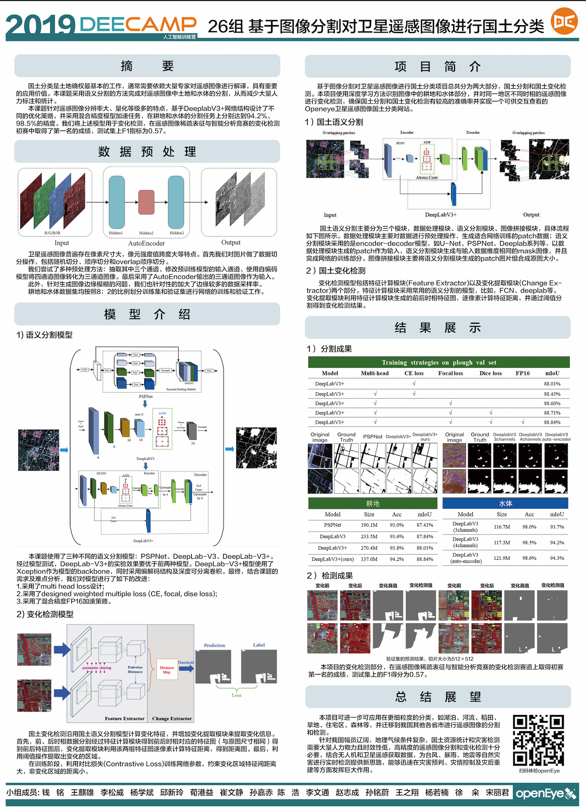

# DeeCamp-Semantic_Image_Segmentation
## Zhixiang Wang

### DeeCamp26组项目——基于图像分割对卫星遥感图像进行国土分类
#### 本项目获得DeeCamp2019终评Rank2/50
#### 26组获得最佳技术奖
 

#### ·前端展示页面：[OpenEye](http://49.232.23.37/index.html)
 
 

